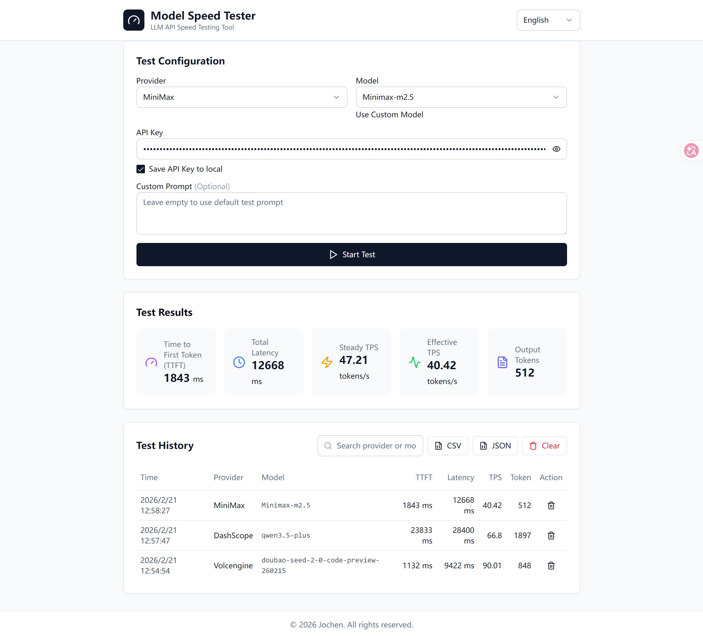

# Model Speed Tester

LLM API Speed Testing Tool - Supports Major Domestic Model Providers



## Features

- **Multi-language Support**: Chinese and English UI, switchable anytime
- **Multi-provider Support**: DashScope (Alibaba), Volcengine, Zhipu AI, Minimax, Kimi
- **Per-provider API Key Storage**: Each provider's API key is saved separately
- **Accurate Metrics**: TTFT (Time To First Token), Steady TPS, Effective TPS
- **History**: LocalStorage persistence, supports search/filter
- **Export**: CSV/JSON export support
- **Modern UI**: Built with shadcn/ui components

## Metrics Explained

| Metric | Description |
|--------|-------------|
| TTFT | Time To First Token - latency from request to first token |
| Total Time | Complete response time from request to final token |
| Steady TPS | Pure generation speed excluding first token (tokens/s) |
| Effective TPS | User-perceived speed including first token (tokens/s) |

## Supported Providers & Models

| Provider | Models |
|----------|--------|
| DashScope (Alibaba) | qwen3.5-plus, qwen3-max |
| Volcengine | doubao-seed-2-0-pro, doubao-seed-2-0-lite, doubao-seed-2-0-code |
| Zhipu AI | glm-4.5, glm-4.6, glm-4.7, glm-5 |
| Minimax | Minimax-M2, M2.1, M2.5, M2.5-highspeed |
| Kimi | kimi-for-coding |
| Custom | Any OpenAI-compatible API |

## Quick Start

```bash
# Install dependencies
npm install

# Start development
npm run dev
```

Open http://localhost:5173 in your browser.

```bash
# Build for production
npm run build
```

Build output is in the `dist` directory.

## Usage

1. Select a provider (or "Custom" for your own API)
2. Select a model (or enter custom model name)
3. Enter your API Key (can be saved locally)
4. Optionally: Enter custom test prompt
5. Click "Start Test"
6. View test results and history

## Tech Stack

- React 18 + Vite
- Tailwind CSS
- shadcn/ui (Radix UI)
- Sonner (Toast notifications)
- Lucide React

## License

MIT
